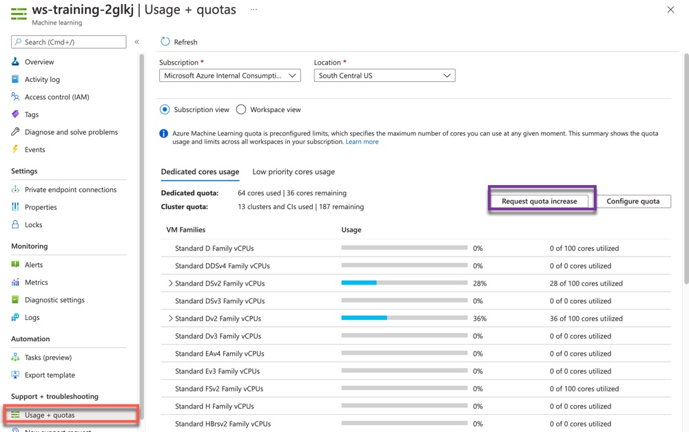

# Setup Scripts for AML Workshop
Setup Scripts and Smoke Tests for Azure Machine Learning Workshops

> __NOTE:__ The ARM Template will now deploy Datastores and Datasets. No need to run CLI commands to attach these datastores or datasets.

Steps to prepare for the workshop:
1. Deploy ARM template into a new Azure Resource Group. This can be done multiple ways:
    * Click the "Deploy to Azure" button above
    * Run CLI commands to deploy. See an example in the Makefile under 'deploy'
1. Ensure all workshop attendees have 'Contributor' (or similar) level access to the RG
1. Ensure you have enough CPU Core quota for the workshop. 
    1. In the Azure Portal, find the AML Workspace
    1. Click on "Usage + Quotas"
    1. Verify that you have enough "Dedicated" Standard DSv2 Family vCPUs quota
        * At least 4 cores / participant would be recommended
    1. Verify that you have enough "Low Priority" cores:
        * Standard DSv2 Family vCPUs (at least 40 recommended)
        * Standard NC Family vCPUs (At least 60 recommended)
    1. If you don't have enough quota, submit a quota increase request.

    